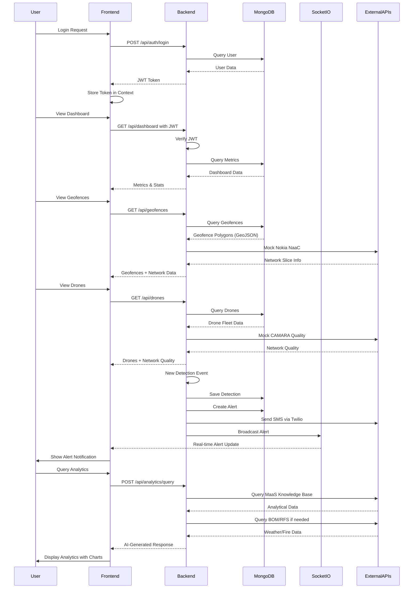
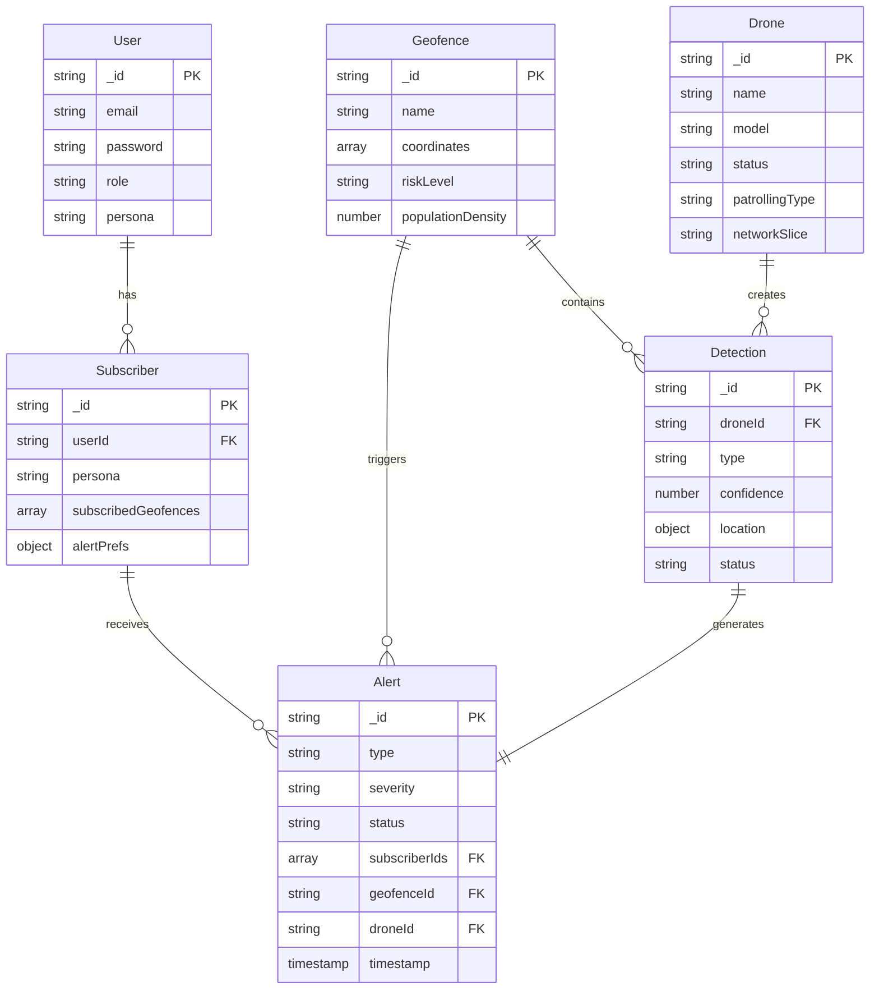

```mermaid
graph TB
    subgraph "Client Layer"
        Browser[Web Browser]
        User[Users - Fire Rangers, Commanders, - Homeowners, Engineers, Biologists]
    end

    subgraph "Frontend Application React & TypeScript"
        subgraph "Pages"
            Dashboard[Dashboard - Overview & Metrics]
            Geofence[Geofence Management - Polygon Mapping]
            Detection[Detection Center - Alert Generation]
            Drones[Drone Fleet - Fleet Management]
            Subscribers[Subscriber Management - User Management]
            Alerts[Alerts Page - Alert History]
            Analytics[Analytics Page - AI Assistant]
            Login[Login Page]
            Profile[Profile Page]
        end

        subgraph "Components"
            Layout[Layout Components - TopBar, Sidebar, Footer]
            Map[Map Components - Leaflet Integration]
            Charts[Chart Components - Recharts]
        end

        subgraph "State Management"
            AuthContext[AuthContext - JWT Authentication]
            Axios[Axios Client - API Communication]
        end
    end

    subgraph "Backend API Node.js and Express"
        subgraph "API Routes"
            AuthRoute[/api/auth - Login, Register, /me]
            DroneRoute[/api/drones - Fleet Operations]
            GeofenceRoute[/api/geofences - Geofence CRUD]
            DetectionRoute[/api/detections - Detection Events]
            AlertRoute[/api/alerts - Alert Management]
            SubscriberRoute[/api/subscribers - Subscriber CRUD]
            DashboardRoute[/api/dashboard - Metrics & Stats]
        end

        subgraph "Middleware"
            AuthMiddleware[JWT Auth Middleware - Token Validation]
            CORS[CORS Middleware]
        end

        subgraph "Data Models"
            UserModel[User Model - Authentication]
            DroneModel[Drone Model - Fleet Data]
            GeofenceModel[Geofence Model - Polygon Data]
            DetectionModel[Detection Model - Fire Events]
            AlertModel[Alert Model - Notifications]
            SubscriberModel[Subscriber Model - User Subscriptions]
        end

        subgraph "Utilities"
            DemoData[Demo Data Generator - Fallback Data]
            Seed[Database Seeder - Initial Data]
            MockAPIs[Mock API Clients - CAMARA, Nokia, Twilio]
        end

        SocketIO[Socket.io Server - Real-time Alerts]
    end

    subgraph "Database Layer"
        MongoDB[MongoDB - Primary Database]
        GeoJSON[GeoJSON Collections - Geofence Polygons]
    end

    subgraph "External APIs Mocked"
        CAMARA[CAMARA APIs - SIM Swap Detection - Quality on Demand]
        Nokia[Nokia NaaC - Network as a Code - Geofence Orchestration]
        Twilio[Twilio SMS - Alert Notifications]
    end

    subgraph "External Services"
        BOM[BOM API - Weather Data]
        RFS[RFS API - Fire Service Data]
        MaaS[MaaS APIs - Knowledge Base - Q&A Assistant]
    end

    %% User interactions
    User --> Browser
    Browser --> Login
    Login --> AuthContext
    AuthContext --> AuthRoute

    %% Frontend navigation
    Dashboard --> Map
    Dashboard --> Charts
    Geofence --> Map
    Detection --> Map
    Alerts --> Map
    Analytics --> Charts

    %% Frontend to Backend
    Dashboard --> Axios
    Geofence --> Axios
    Detection --> Axios
    Drones --> Axios
    Subscribers --> Axios
    Alerts --> Axios
    Analytics --> Axios
    Profile --> Axios

    Axios --> AuthRoute
    Axios --> DroneRoute
    Axios --> GeofenceRoute
    Axios --> DetectionRoute
    Axios --> AlertRoute
    Axios --> SubscriberRoute
    Axios --> DashboardRoute

    %% Backend routing
    AuthRoute --> AuthMiddleware
    DroneRoute --> AuthMiddleware
    GeofenceRoute --> AuthMiddleware
    DetectionRoute --> AuthMiddleware
    AlertRoute --> AuthMiddleware
    SubscriberRoute --> AuthMiddleware
    DashboardRoute --> AuthMiddleware

    %% Backend to Models
    AuthRoute --> UserModel
    DroneRoute --> DroneModel
    GeofenceRoute --> GeofenceModel
    DetectionRoute --> DetectionModel
    AlertRoute --> AlertModel
    SubscriberRoute --> SubscriberModel

    %% Models to Database
    UserModel --> MongoDB
    DroneModel --> MongoDB
    GeofenceModel --> MongoDB
    GeofenceModel --> GeoJSON
    DetectionModel --> MongoDB
    AlertModel --> MongoDB
    SubscriberModel --> MongoDB

    %% Fallback data
    DroneRoute --> DemoData
    GeofenceRoute --> DemoData
    DetectionRoute --> DemoData
    AlertRoute --> DemoData
    SubscriberRoute --> DemoData
    DemoData --> MongoDB

    %% Database seeding
    Seed --> MongoDB
    Seed --> UserModel
    Seed --> DroneModel
    Seed --> GeofenceModel
    Seed --> DetectionModel
    Seed --> AlertModel
    Seed --> SubscriberModel

    %% Real-time communication
    SocketIO --> Browser
    AlertRoute --> SocketIO
    DetectionRoute --> SocketIO

    %% External API integrations
    SubscriberRoute --> MockAPIs
    GeofenceRoute --> MockAPIs
    DroneRoute --> MockAPIs
    MockAPIs --> CAMARA
    MockAPIs --> Nokia
    MockAPIs --> Twilio

    %% Analytics integrations
    Analytics --> MaaS
    Analytics --> BOM
    Analytics --> RFS

    %% Styling
    classDef frontend fill:#61dafb,stroke:#20232a,stroke-width:2px
    classDef backend fill:#339933,stroke:#20232a,stroke-width:2px
    classDef database fill:#4db33d,stroke:#20232a,stroke-width:2px
    classDef external fill:#ff6b35,stroke:#20232a,stroke-width:2px
    classDef realtime fill:#f39c12,stroke:#20232a,stroke-width:2px

    class Dashboard,Geofence,Detection,Drones,Subscribers,Alerts,Analytics,Login,Profile,Layout,Map,Charts,AuthContext,Axios frontend
    class AuthRoute,DroneRoute,GeofenceRoute,DetectionRoute,AlertRoute,SubscriberRoute,DashboardRoute,AuthMiddleware,CORS,UserModel,DroneModel,GeofenceModel,DetectionModel,AlertModel,SubscriberModel,DemoData,Seed,MockAPIs backend
    class MongoDB,GeoJSON database
    class CAMARA,Nokia,Twilio,BOM,RFS,MaaS external
    class SocketIO realtime
```

### System Flow



### Data Model Relationships

