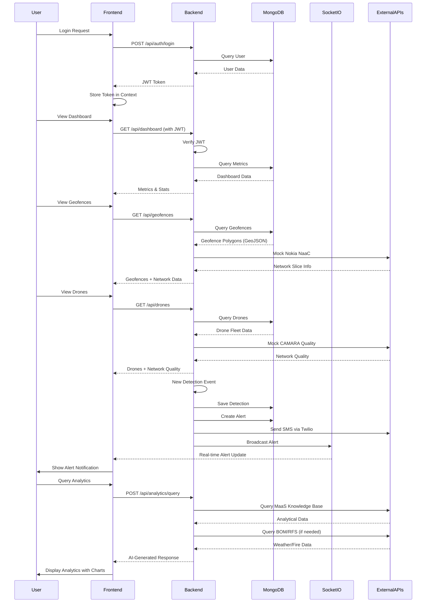
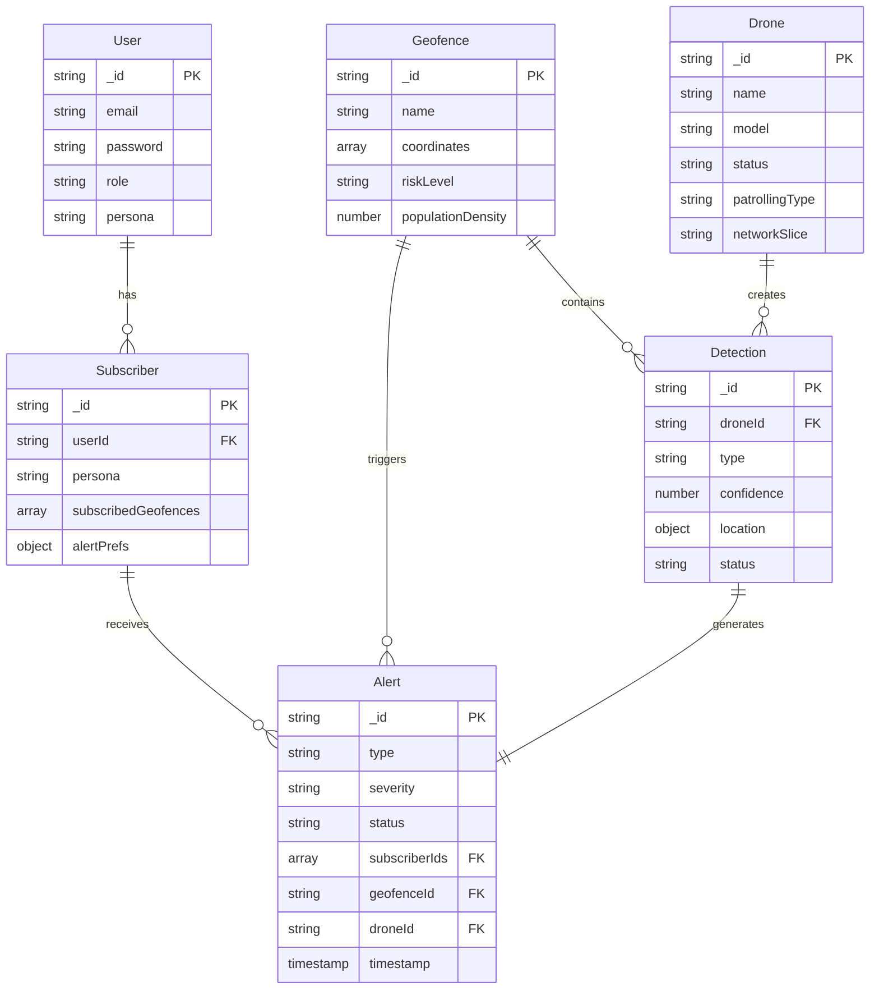

# BushFire Sentinel 🌿🔥

**Revolutionizing Australian Bushfire Management with Telstra's Network APIs**

A production-ready web application for proactive and reactive bushfire defense, integrating BVLOS drone swarms with Telstra 5G URLLC slices, Nokia's Network as a Code platform, and CAMARA APIs.

## 🎯 Mission

Deploy AI-powered drone fleets for:
- **Proactive Defense**: Autonomous sweeps detecting 2°C thermal spikes (72-hour forecasts)
- **Reactive Response**: Swarm mapping of perimeters/hotspots through smoke
- **Wildlife Protection**: Koala rescue and ecosystem monitoring
- **Grid Resilience**: Utility infrastructure protection

## 🏗️ Architecture

- **Frontend**: React + TypeScript + Material-UI
- **Backend**: Node.js + Express + Socket.io
- **Database**: MongoDB (GeoJSON for geofences)
- **Maps**: Leaflet.js (Australia-focused)
- **3D Visualization**: Three.js
- **Real-time**: WebSocket for alerts
- **Deployment**: Vercel (frontend) + Render (backend)

### Architecture Diagram

```mermaid
graph TB
    subgraph "Client Layer"
        Browser[Web Browser]
        User[Users<br/>Fire Rangers, Commanders,<br/>Homeowners, Engineers, Biologists]
    end

    subgraph "Frontend Application (React + TypeScript)"
        subgraph "Pages"
            Dashboard[Dashboard<br/>Overview & Metrics]
            Geofence[Geofence Management<br/>Polygon Mapping]
            Detection[Detection Center<br/>Alert Generation]
            Drones[Drone Fleet<br/>Fleet Management]
            Subscribers[Subscriber Management<br/>User Management]
            Alerts[Alerts Page<br/>Alert History]
            Analytics[Analytics Page<br/>AI Assistant]
            Login[Login Page]
            Profile[Profile Page]
        end

        subgraph "Components"
            Layout[Layout Components<br/>TopBar, Sidebar, Footer]
            Map[Map Components<br/>Leaflet Integration]
            Charts[Chart Components<br/>Recharts]
        end

        subgraph "State Management"
            AuthContext[AuthContext<br/>JWT Authentication]
            Axios[Axios Client<br/>API Communication]
        end
    end

    subgraph "Backend API (Node.js + Express)"
        subgraph "API Routes"
            AuthRoute[/api/auth<br/>Login, Register, /me]
            DroneRoute[/api/drones<br/>Fleet Operations]
            GeofenceRoute[/api/geofences<br/>Geofence CRUD]
            DetectionRoute[/api/detections<br/>Detection Events]
            AlertRoute[/api/alerts<br/>Alert Management]
            SubscriberRoute[/api/subscribers<br/>Subscriber CRUD]
            DashboardRoute[/api/dashboard<br/>Metrics & Stats]
        end

        subgraph "Middleware"
            AuthMiddleware[JWT Auth Middleware<br/>Token Validation]
            CORS[CORS Middleware]
        end

        subgraph "Data Models"
            UserModel[User Model<br/>Authentication]
            DroneModel[Drone Model<br/>Fleet Data]
            GeofenceModel[Geofence Model<br/>Polygon Data]
            DetectionModel[Detection Model<br/>Fire Events]
            AlertModel[Alert Model<br/>Notifications]
            SubscriberModel[Subscriber Model<br/>User Subscriptions]
        end

        subgraph "Utilities"
            DemoData[Demo Data Generator<br/>Fallback Data]
            Seed[Database Seeder<br/>Initial Data]
            MockAPIs[Mock API Clients<br/>CAMARA, Nokia, Twilio]
        end

        SocketIO[Socket.io Server<br/>Real-time Alerts]
    end

    subgraph "Database Layer"
        MongoDB[(MongoDB<br/>Primary Database)]
        GeoJSON[GeoJSON Collections<br/>Geofence Polygons]
    end

    subgraph "External APIs (Mocked)"
        CAMARA[CAMARA APIs<br/>SIM Swap Detection<br/>Quality on Demand]
        Nokia[Nokia NaaC<br/>Network as a Code<br/>Geofence Orchestration]
        Twilio[Twilio SMS<br/>Alert Notifications]
    end

    subgraph "External Services"
        BOM[BOM API<br/>Weather Data]
        RFS[RFS API<br/>Fire Service Data]
        MaaS[MaaS APIs<br/>Knowledge Base<br/>Q&A Assistant]
    end

    %% User interactions
    User --> Browser
    Browser --> Login
    Login --> AuthContext
    AuthContext --> AuthRoute

    %% Frontend navigation
    Dashboard --> Map
    Dashboard --> Charts
    Geofence --> Map
    Detection --> Map
    Alerts --> Map
    Analytics --> Charts

    %% Frontend to Backend
    Dashboard --> Axios
    Geofence --> Axios
    Detection --> Axios
    Drones --> Axios
    Subscribers --> Axios
    Alerts --> Axios
    Analytics --> Axios
    Profile --> Axios

    Axios --> AuthRoute
    Axios --> DroneRoute
    Axios --> GeofenceRoute
    Axios --> DetectionRoute
    Axios --> AlertRoute
    Axios --> SubscriberRoute
    Axios --> DashboardRoute

    %% Backend routing
    AuthRoute --> AuthMiddleware
    DroneRoute --> AuthMiddleware
    GeofenceRoute --> AuthMiddleware
    DetectionRoute --> AuthMiddleware
    AlertRoute --> AuthMiddleware
    SubscriberRoute --> AuthMiddleware
    DashboardRoute --> AuthMiddleware

    %% Backend to Models
    AuthRoute --> UserModel
    DroneRoute --> DroneModel
    GeofenceRoute --> GeofenceModel
    DetectionRoute --> DetectionModel
    AlertRoute --> AlertModel
    SubscriberRoute --> SubscriberModel

    %% Models to Database
    UserModel --> MongoDB
    DroneModel --> MongoDB
    GeofenceModel --> MongoDB
    GeofenceModel --> GeoJSON
    DetectionModel --> MongoDB
    AlertModel --> MongoDB
    SubscriberModel --> MongoDB

    %% Fallback data
    DroneRoute --> DemoData
    GeofenceRoute --> DemoData
    DetectionRoute --> DemoData
    AlertRoute --> DemoData
    SubscriberRoute --> DemoData
    DemoData --> MongoDB

    %% Database seeding
    Seed --> MongoDB
    Seed --> UserModel
    Seed --> DroneModel
    Seed --> GeofenceModel
    Seed --> DetectionModel
    Seed --> AlertModel
    Seed --> SubscriberModel

    %% Real-time communication
    SocketIO --> Browser
    AlertRoute --> SocketIO
    DetectionRoute --> SocketIO

    %% External API integrations
    SubscriberRoute --> MockAPIs
    GeofenceRoute --> MockAPIs
    DroneRoute --> MockAPIs
    MockAPIs --> CAMARA
    MockAPIs --> Nokia
    MockAPIs --> Twilio

    %% Analytics integrations
    Analytics --> MaaS
    Analytics --> BOM
    Analytics --> RFS

    %% Styling
    classDef frontend fill:#61dafb,stroke:#20232a,stroke-width:2px
    classDef backend fill:#339933,stroke:#20232a,stroke-width:2px
    classDef database fill:#4db33d,stroke:#20232a,stroke-width:2px
    classDef external fill:#ff6b35,stroke:#20232a,stroke-width:2px
    classDef realtime fill:#f39c12,stroke:#20232a,stroke-width:2px

    class Dashboard,Geofence,Detection,Drones,Subscribers,Alerts,Analytics,Login,Profile,Layout,Map,Charts,AuthContext,Axios frontend
    class AuthRoute,DroneRoute,GeofenceRoute,DetectionRoute,AlertRoute,SubscriberRoute,DashboardRoute,AuthMiddleware,CORS,UserModel,DroneModel,GeofenceModel,DetectionModel,AlertModel,SubscriberModel,DemoData,Seed,MockAPIs backend
    class MongoDB,GeoJSON database
    class CAMARA,Nokia,Twilio,BOM,RFS,MaaS external
    class SocketIO realtime
```

### System Flow



### Data Model Relationships



## 🚀 Quick Start

```bash
# Install dependencies
npm install

# Run development servers
npm run dev

# Build for production
npm run build
```

## 📦 Deployment

### GitHub Pages

The application is automatically deployed to GitHub Pages on every push to the `main` branch via GitHub Actions.

**Setup Instructions:**
1. Go to your repository Settings → Pages
2. Under "Source", select "GitHub Actions"
3. The workflow will automatically deploy on push to `main` branch

**Manual Deployment:**
- Go to Actions tab → "Deploy to GitHub Pages" → "Run workflow"

**Environment Variables (Optional):**
- `VITE_API_URL`: Backend API URL (defaults to Render backend URL)
- Set in repository Settings → Secrets and variables → Actions

### Local Development

For local development, the frontend runs on `http://localhost:3000` and proxies API requests to `http://localhost:5000`.

## 👥 Personas

- **Fire Ranger** (Proactive patrols)
- **Incident Commander** (Reactive coordination)
- **Rural Homeowner** (Ember alerts)
- **Utility Engineer** (Grid resilience)
- **Wildlife Biologist** (Ecosystem monitoring)

## 🇦🇺 Australian Localization

Tailored for NSW, VIC, QLD, WA, TAS with:
- Local terminology (bushfire, ember attack, backburn)
- Regional references (Blue Mountains, Great Ocean Road)
- Wildlife focus (koalas, wallabies, wedge-tailed eagles)
- Real events (Black Summer 2019-20, Red Dawn 2024)

## 📄 License

MIT

---

Built for Telstra Hackathon 2025

