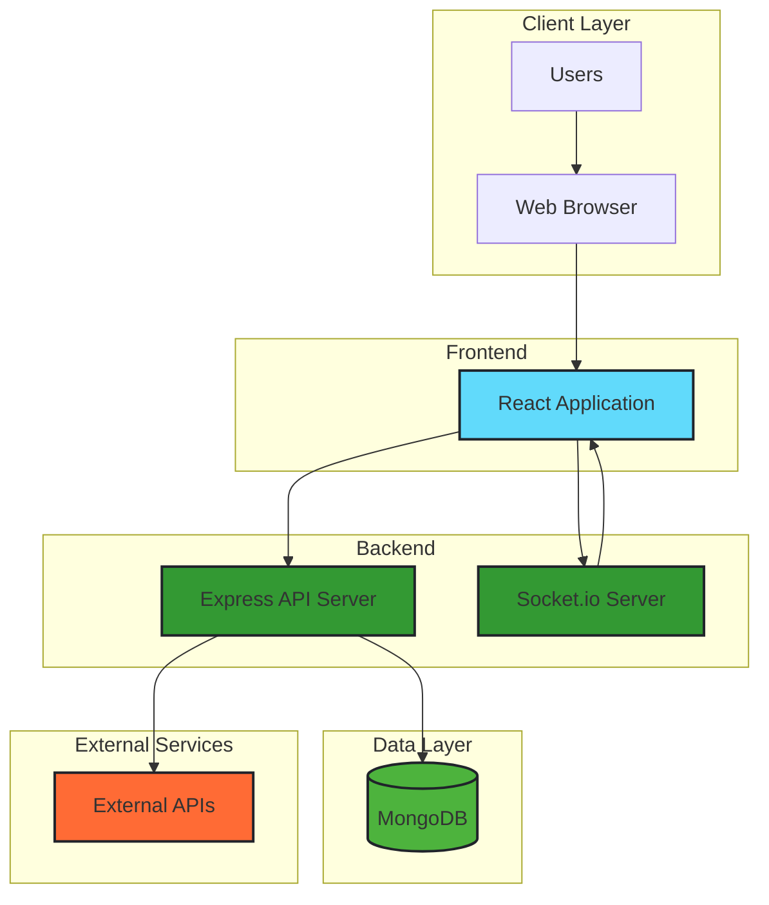
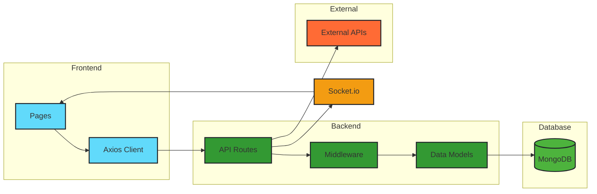
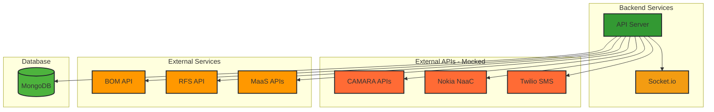
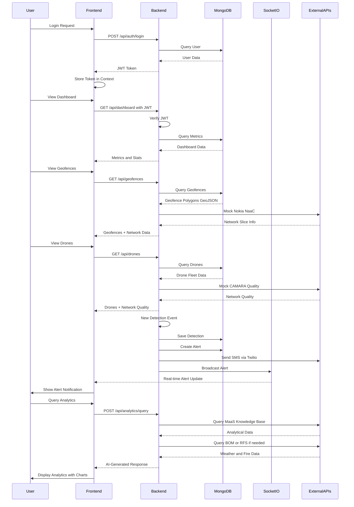
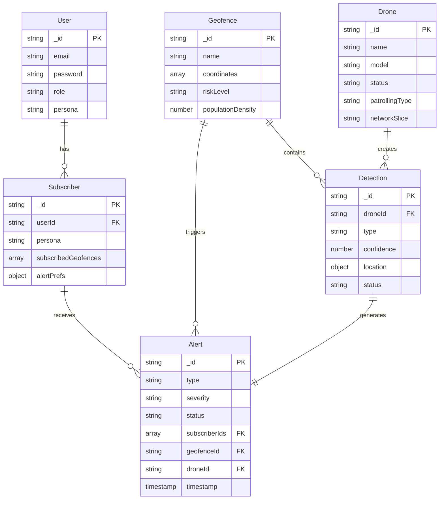

# Architecture Overview

## High-Level Architecture

## Frontend Architecture

```mermaid
graph TB
    subgraph "Pages"
        Dashboard[Dashboard]
        Geofence[Geofence]
        Detection[Detection]
        Drones[Drones]
        Subscribers[Subscribers]
        Alerts[Alerts]
        Analytics[Analytics]
        Login[Login]
    end

    subgraph "Shared Components"
        Layout[Layout]
        Map[Map Components]
        Charts[Chart Components]
    end

    subgraph "State Management"
        AuthContext[Auth Context]
        AxiosClient[Axios Client]
    end

    Dashboard --> Layout
    Geofence --> Layout
    Detection --> Layout
    Drones --> Layout
    Subscribers --> Layout
    Alerts --> Layout
    Analytics --> Layout

    Dashboard --> Map
    Dashboard --> Charts
    Geofence --> Map
    Detection --> Map
    Alerts --> Map
    Analytics --> Charts

    Login --> AuthContext
    Dashboard --> AuthContext
    Geofence --> AuthContext
    Detection --> AuthContext
    Drones --> AuthContext
    Subscribers --> AuthContext
    Alerts --> AuthContext
    Analytics --> AuthContext

    Dashboard --> AxiosClient
    Geofence --> AxiosClient
    Detection --> AxiosClient
    Drones --> AxiosClient
    Subscribers --> AxiosClient
    Alerts --> AxiosClient
    Analytics --> AxiosClient

    classDef pages fill:#61dafb,stroke:#20232a,stroke-width:2px
    classDef components fill:#90caf9,stroke:#20232a,stroke-width:2px
    classDef state fill:#42a5f5,stroke:#20232a,stroke-width:2px

    class Dashboard,Geofence,Detection,Drones,Subscribers,Alerts,Analytics,Login pages
    class Layout,Map,Charts components
    class AuthContext,AxiosClient state
```

## Backend Architecture

```mermaid
graph TB
    subgraph "API Routes"
        AuthRoute["/api/auth"]
        DroneRoute["/api/drones"]
        GeofenceRoute["/api/geofences"]
        DetectionRoute["/api/detections"]
        AlertRoute["/api/alerts"]
        SubscriberRoute["/api/subscribers"]
        DashboardRoute["/api/dashboard"]
    end

    subgraph "Middleware"
        AuthMiddleware[JWT Auth]
        CORS[CORS]
    end

    subgraph "Data Models"
        UserModel[User]
        DroneModel[Drone]
        GeofenceModel[Geofence]
        DetectionModel[Detection]
        AlertModel[Alert]
        SubscriberModel[Subscriber]
    end

    subgraph "Utilities"
        DemoData[Demo Data]
        Seed[Database Seeder]
        MockAPIs[Mock APIs]
    end

    subgraph "Real-time"
        SocketIO[Socket.io]
    end

    AuthRoute --> AuthMiddleware
    DroneRoute --> AuthMiddleware
    GeofenceRoute --> AuthMiddleware
    DetectionRoute --> AuthMiddleware
    AlertRoute --> AuthMiddleware
    SubscriberRoute --> AuthMiddleware
    DashboardRoute --> AuthMiddleware

    AuthRoute --> UserModel
    DroneRoute --> DroneModel
    GeofenceRoute --> GeofenceModel
    DetectionRoute --> DetectionModel
    AlertRoute --> AlertModel
    SubscriberRoute --> SubscriberModel

    DroneRoute --> DemoData
    GeofenceRoute --> DemoData
    DetectionRoute --> DemoData
    AlertRoute --> DemoData
    SubscriberRoute --> DemoData

    AlertRoute --> SocketIO
    DetectionRoute --> SocketIO

    SubscriberRoute --> MockAPIs
    GeofenceRoute --> MockAPIs
    DroneRoute --> MockAPIs

    classDef routes fill:#339933,stroke:#20232a,stroke-width:2px
    classDef middleware fill:#66bb6a,stroke:#20232a,stroke-width:2px
    classDef models fill:#81c784,stroke:#20232a,stroke-width:2px
    classDef utils fill:#a5d6a7,stroke:#20232a,stroke-width:2px
    classDef realtime fill:#f39c12,stroke:#20232a,stroke-width:2px

    class AuthRoute,DroneRoute,GeofenceRoute,DetectionRoute,AlertRoute,SubscriberRoute,DashboardRoute routes
    class AuthMiddleware,CORS middleware
    class UserModel,DroneModel,GeofenceModel,DetectionModel,AlertModel,SubscriberModel models
    class DemoData,Seed,MockAPIs utils
    class SocketIO realtime
```

## Data Flow Architecture

## Integration Architecture

# System Flow

# Data Model Relationships

